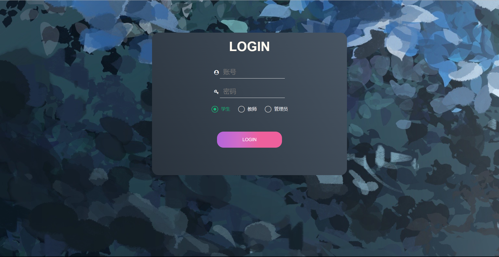

# 学生作业管理系统设计文档

## 实现技术
- JSP
- Maven
- MySQL
- MyBatis

## 前端框架
- Layui

## 项目结构与命名规范
本项目遵循阿里巴巴前后端代码规范，确保代码规范性与可维护性。

- 目录结构：
    - `src/main/java`：Java源代码
        - `controller`：控制器层，负责处理HTTP请求、调用业务逻辑
        - `mapper`：数据访问层，与数据库进行交互
        - `model`：模型层，定义数据结构和实体类
        - `utils`：工具类
    - `src/main/resources`：配置文件
        - `mapper`：MyBatis映射文件
        - `mybatis-config.xml`：mybatis配置文件
        - `test_demo.sql`：数据库sql文件
    - `src/main/webapp`：前端页面与静态资源
        - `css`：css文件
        - `img`：图片
        - `js`：js文件
        - `jsp`：JSP页面文件夹
        - `utils`：工具文件夹，整合了layui
        - `WEB-INF`：Web配置文件夹

- 命名规范：
    - 包名：使用反转的域名，如`com.example.exam`
    - 类名：使用大驼峰命名法，如`ExamController`
    - 方法名：使用小驼峰命名法，如`loginUser`
    - 变量名：使用小驼峰命名法，如`examName`
    - 常量名：全部大写，用下划线分隔单词，如`MAX_SCORE`

以上是在线作业布置系统的项目结构与命名规范，遵循阿里巴巴前后端代码规范保证代码的规范性与可维护性。

## 1. 功能

### 1.1 管理员
- 登录
- 个人信息管理
- 教师信息管理
- 学生信息管理
- 登录日志管理

### 1.2 教师
- 登录
- 个人信息管理
- 题库管理
- 作业管理
- 作业布置管理
- 评卷管理
- 成绩管理

### 1.3 学生
- 登录
- 个人信息管理
- 作业管理
- 成绩管理

## 2. 数据库设计

### 2.1 登录（login）
- user_id
- account
- password
- identity

### 2.2 管理员个人信息（administrator_information）
- admin_id
- user_id
- user_name
- gender
- age
 
### 2.3 教师个人信息（teacher_information）
- user_id
- job_id
- user_name
- entry_year
- gender
- age

### 2.4 学生个人信息（student_information）
- user_id
- student_id
- user_name
- grade
- class_name
- major
- gender
- age

### 2.5 登录日志（log）
- log_id
- user_id
- log_time
- state

### 2.6 题库管理（question）
- question_id
- question_types
- question_name
- creation_time
- modification_time
- question_description
- choice_a
- choice_b
- choice_c
- choice_d
- solution

### 2.7 作业管理（examination）
- exam_id
- exam_name
- creation_time
- modification_time

### 2.8 作业题目管理（relation_exam_question）
- req_id
- exam_id
- question_id
- question_score
- order_number

### 2.9 作业布置管理（test）
- test_id
- test_name
- exam_id
- test_start_time
- test_end_time
- class_name

### 2.10 学生题目管理（relation_test_question）
- rtq_id
- test_id
- question_id
- user_id
- answer
- the_score

### 2.11 成绩管理（score）
- score_id
- user_id
- test_id
- total_score
- state
- the_mark_user_id

## 3. 页面设计

### 3.1 登录页面
